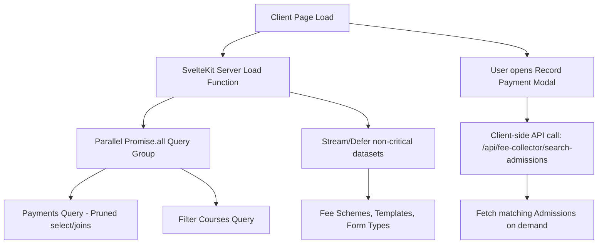

# Implementation Plan: Fee Collector Payments Page Optimization

This document outlines a comprehensive, detailed technical implementation plan to optimize the `/fee-collector/payments` page. It addresses sequentially awaited database queries, excessive nested joins, and unnecessary pre-fetching of dropdown/modal metadata.

---

## 1. Current Performance Bottlenecks

1. **Blocking Sequential Queries:** SvelteKit's `load` function blocks the page render until all `await` calls resolve. Currently, **9 separate queries** are awaited sequentially, cascading database roundtrip times.
2. **Deep, Redundant Joins:** The main payments query fetches details through a 6-layer join: `payments` -> `applications` -> `courses` -> `colleges` -> `universities`. This pulls down heavy static text (such as university logos, websites, phone numbers, and footers) for *every single row* of the transaction grid.
3. **Unnecessary Modal Pre-loading:** The server load function fetches 100 `account_admissions` rows, joins multiple related tables, maps provisional fees, and searches fee structures *on initial page load* solely to populate the "Record Payment" modal, which is hidden by default.
4. **Exact Count Scans:** Requiring `{ count: 'exact' }` forces Postgres to perform table or index scans to get total row counts for pagination, increasing database server CPU load.

---

## 2. Proposed Architecture & Changes



### Component 1: On-Demand Admissions API [NEW]
Create a new server-side API route to query admissions dynamically, offloading this weight from the initial page load.

#### [NEW] [+server.ts](file:///workspaces/admissionapp_v1/src/routes/api/fee-collector/search-admissions/+server.ts)
* Add a GET endpoint to search admissions securely.
* Accept query parameters: `q` (search term for name, email, or admission number) and `limit` (default 50).
* Enforce security by checking the session and role (`fee_collector` only), and applying the college restriction filter.

### Component 2: Frontend Page & Modal Updates [MODIFY]
Update the payments page to load the modal contents asynchronously when opened, and consume streamed promises.

#### [MODIFY] [+page.svelte](file:///workspaces/admissionapp_v1/src/routes/fee-collector/payments/+page.svelte)
* Modify the "Record Payment" button to trigger a loading state and fetch admissions data from the new endpoint.
* Implement an input search inside the modal to let the user filter student admissions reactively (with debouncing) instead of scrolling through 100 preloaded options.
* Wrap secondary widgets (like Report Templates or Fee Schemes dropdowns) in Svelte `{#await}` blocks to handle streamed promises from the server.

### Component 3: Server Load Optimization [MODIFY]
Refactor the loading script to optimize queries, clean up joins, execute queries in parallel, and stream secondary metadata.

#### [MODIFY] [+page.server.ts](file:///workspaces/admissionapp_v1/src/routes/fee-collector/payments/+page.server.ts)
* **Select Pruning:** Remove the heavy, static university joins from the transaction row list. Retrieve only core information:
  ```typescript
  applications (
      id,
      course_id,
      form_type,
      student_user:users!student_id (full_name, email, student_profiles(enrollment_number)),
      courses (name, college_id),
      branches (name)
  )
  ```
* **Parallel Queries:** Group critical load queries into a single `Promise.all` block to resolve them concurrently:
  * Pruned `paymentsQuery` (paginated range)
  * Count query (using `{ count: 'planned' }` or caching if possible, or `{ count: 'exact' }` on the pruned query)
  * `coursesQuery`
* **Streaming Metadata:** Return non-blocking promises for secondary metadata directly to SvelteKit:
  * `feeSchemes`
  * `profileTemplates`
  * `formTypes`
* **Prune Admissions:** Completely remove the `account_admissions`, provisional mapping, and `fee_structures` loop from the block load since they are moved to the dynamic search API.

---

## 3. Step-by-Step Implementation Plan

### Step 1: Create the Search Admissions API Endpoint
Initialize `src/routes/api/fee-collector/search-admissions/+server.ts`.
```typescript
import { json, error } from '@sveltejs/kit';
import type { RequestHandler } from './$types';
import { applyRoleBasedCollegeFilter } from '$lib/server/security';

export const GET: RequestHandler = async ({ locals: { supabase, getAuthenticatedUser, userProfile }, url }) => {
    const user = await getAuthenticatedUser();
    if (!user || userProfile?.role !== 'fee_collector') {
        throw error(401, 'Unauthorized');
    }

    const search = url.searchParams.get('q') || '';
    
    let query = supabase
        .from('account_admissions')
        .select(`
            id,
            admission_number,
            application_id,
            applications!inner(
                id,
                student_user:users!applications_student_id_fkey(full_name, email),
                course_id,
                cycle_id,
                form_type,
                admission_type,
                assigned_fee_scheme_id,
                courses!inner(name, college_id),
                admission_cycles(academic_year_id)
            )
        `);

    if (search) {
        query = query.or(`full_name.ilike.%${search}%,email.ilike.%${search}%,admission_number.ilike.%${search}%`, { foreignTable: 'applications.student_user' });
    }

    query = applyRoleBasedCollegeFilter(query, userProfile, 'admissions');

    const { data: rawAdmissions, error: dbError } = await query
        .order('created_at', { ascending: false })
        .limit(50);

    if (dbError) throw error(500, dbError.message);

    // Fetch form types mappings to filter out provisional forms
    const { data: formTypes } = await supabase.from('form_types').select('name, is_prov');
    const formTypesMap = new Map((formTypes || []).map(ft => [ft.name, ft.is_prov]));

    const admissions = rawAdmissions?.filter(adm => {
        const formType = (adm.applications as any)?.form_type;
        const isProv = formTypesMap.get(formType) || false;
        return !isProv;
    }) || [];

    return json(admissions);
};
```

### Step 2: Implement Parallel Loading on `+page.server.ts`
Refactor the load logic using `Promise.all`:
```typescript
export const load: PageServerLoad = async ({ locals: { supabase, getAuthenticatedUser, userProfile }, url }) => {
    const authenticatedUser = await getAuthenticatedUser();
    if (!authenticatedUser || userProfile?.role !== 'fee_collector') {
        throw redirect(303, '/login');
    }

    const searchTerm = url.searchParams.get('search') || '';
    const courseIdFilter = url.searchParams.get('course_id') || '';
    const activeTab = (url.searchParams.get('type') || 'tuition') as 'tuition' | 'application' | 'provisional';
    const page = parseInt(url.searchParams.get('page') || '1');
    const limit = parseInt(url.searchParams.get('limit') || '25');
    const from = (page - 1) * limit;
    const to = from + limit - 1;

    const tabToDbType = {
        'tuition': 'tuition_fee',
        'application': 'application_fee',
        'provisional': 'provisional_fee'
    };
    const dbPaymentType = tabToDbType[activeTab];

    // Build optimized payments query (Pruned select list)
    let paymentsQuery = supabase
        .from('payments')
        .select(`
            *,
            applications!inner (
                id,
                course_id,
                form_type,
                student_user:users!student_id (full_name, email, student_profiles(enrollment_number)),
                courses!inner (name, college_id),
                branches(name),
                admission_cycles(academic_years(name)),
                account_admissions(admission_number)
            )
        `, { count: 'exact' })
        .eq('payment_type', dbPaymentType);

    if (courseIdFilter) {
        paymentsQuery = paymentsQuery.eq('applications.course_id', courseIdFilter);
    }
    if (searchTerm) {
        paymentsQuery = paymentsQuery.or(`full_name.ilike.%${searchTerm}%,email.ilike.%${searchTerm}%`, { foreignTable: 'applications.student_user' });
    }
    paymentsQuery = applyRoleBasedCollegeFilter(paymentsQuery, userProfile, 'payments');

    // Build courses query
    let coursesQuery = supabase.from('courses').select('id, name');
    coursesQuery = applyRoleBasedCollegeFilter(coursesQuery, userProfile, 'courses');

    // Execute critical queries in PARALLEL
    const [paymentsRes, coursesRes] = await Promise.all([
        paymentsQuery.order('payment_date', { ascending: false }).range(from, to),
        coursesQuery.order('name')
    ]);

    const allPayments = paymentsRes.data || [];
    const totalPaymentsCount = paymentsRes.count || 0;
    const courses = coursesRes.data || [];

    // Stream non-critical metadata queries (Deferred / Asynchronous)
    const lazy = {
        feeSchemes: supabase.from('fee_schemes').select('id, name').eq('is_active', true).order('name').then(r => r.data || []),
        profileTemplates: supabase.from('report_templates').select('id, name, target_form_type_id').eq('report_type', 'html_profile').contains('allowed_roles', ['fee_collector']).then(r => r.data || []),
        formTypes: supabase.from('form_types').select('id, name').then(r => r.data || [])
    };

    return {
        payments: allPayments,
        tuitionPayments: activeTab === 'tuition' ? allPayments : [],
        applicationFeePayments: activeTab === 'application' ? allPayments : [],
        provisionalFeePayments: activeTab === 'provisional' ? allPayments : [],
        courses,
        userProfile,
        pagination: {
            page,
            limit,
            total: totalPaymentsCount,
            totalPages: Math.ceil(totalPaymentsCount / limit)
        },
        searchTerm,
        selectedCourseId: courseIdFilter,
        activeTab,
        streamed: lazy // Streamed promises
    };
};
```

---

## 4. Verification Plan

### Metrics to Measure
1. **TTFB (Time to First Byte):** Compare page latency under sequential loading vs optimized parallel loading.
2. **Transfer Size:** Verify that reducing nested JSON parameters decreases transfer payload size.
3. **Database Load:** Check database server CPU/connection pool metrics under concurrent user lookups.

### Verification Steps
1. Log in as a `fee_collector` user and load `/fee-collector/payments`.
2. Confirm the main payments grid displays successfully with proper pagination and filtration.
3. Open the **Record Payment** modal. Verify that it executes a network fetch to `/api/fee-collector/search-admissions` only when opened.
4. Verify that typing in the search bar inside the modal updates suggestions reactively with debounced requests.
